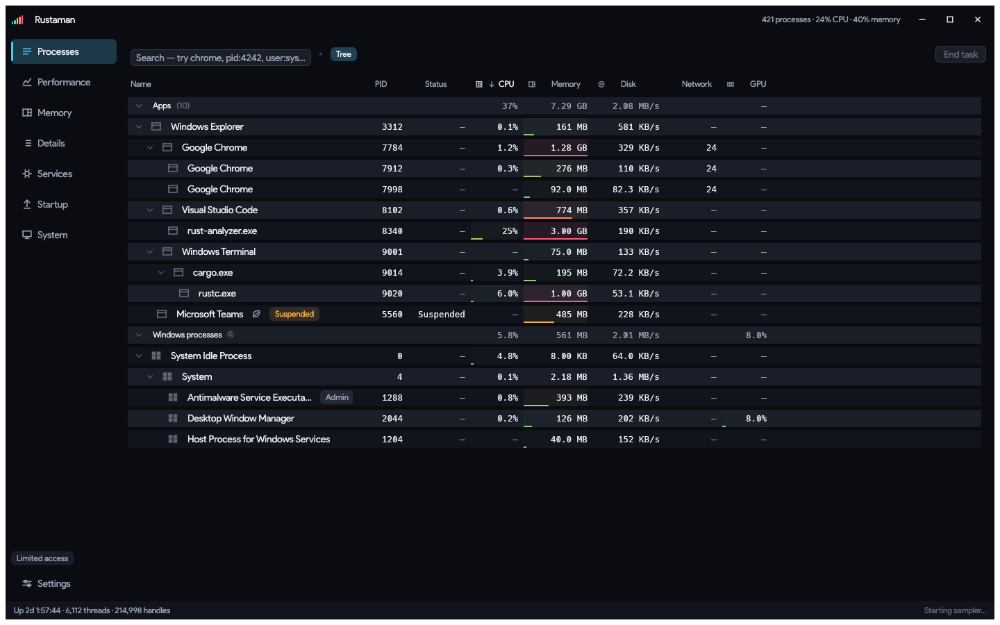

<div align="center">


# Rustaman

**A modern Windows task manager.**

</div>

The one that ships with Windows is slow to open, freezes exactly when the
machine is busy, and looks like it was designed in 2012 because it was.
Rustaman is a native Rust rewrite of the idea: the same data, read through
the same interfaces, in a window that stays responsive when the machine
does not.



*The Processes view, rendered by the repository's offscreen screenshot harness.*

- **Periodic monitoring stays off the UI thread.** A background sampler
  overwrites a latest-value mailbox; the window draws the freshest snapshot.
  Explicit user actions remain synchronous so their result is immediate.
- **One `NtQuerySystemInformation` call** gets CPU, memory and I/O for
  every process at once, instead of the ~2,500 syscalls per second the
  documented route costs — and unlike that route, it can see protected
  system processes.
- **Eight themes, or write your own.** A theme is thirteen colours in a
  TOML file. Everything else is derived, and every theme is checked
  against WCAG contrast as a build step.
- **Rainbow accents that mean something.** Per-core graphs, chart series
  and category chips all index one perceptually-even OKLCh ramp, so no
  series looks more important than its neighbours.

---

## What it does

| View | |
|---|---|
| **Processes** | A real tree, grouped into Apps / Background / Windows. Collapsed parents carry their subtree's totals, so a browser's thirty renderers do not hide behind it. Cells are heat-tinted by load, so a glance down a column finds the heavy rows. |
| **Performance** | CPU (total, kernel band, labeled logical-processor grid, and recent averages/peaks), memory and commit pressure including kernel pools, per-disk **active time** and throughput, network link/totals, and GPU engines and dedicated memory. |
| **Memory** | A per-process treemap showing what is holding physical memory and how each selected process is using it. |
| **Details** | One flat technical table plus an inspector: owner, session, bitness, elevation, handles, threads, cumulative I/O, full path. |
| **Services** | Every Win32 service with its state and hosting PID, and "go to process" to jump from `svchost.exe` to whichever of its fifteen services is busy. |
| **Startup** | Canonical user/machine `Run` and `RunOnce` registry views plus both Startup folders, including Task Manager approval state. |
| **System** | Windows edition/build, computer model, firmware, processor, memory, storage, graphics, network hardware, and live machine totals. |

Actions: end task, end process tree best-effort from the current snapshot (children first), suspend, resume,
priority, open file location, copy details, start/stop a service.

### Search

The box takes plain text, or `field:value` terms combined with AND:

```
chrome                    anything matching "chrome"
pid:4242                  by process id
user:system               owned by SYSTEM — unambiguously
-chrome user:alice        alice's processes, excluding chrome
"visual studio"           a phrase
```

### Keyboard

| | |
|---|---|
| `Delete` | End the selected task |
| `F5` | Re-read services and startup entries |
| `Ctrl+F` | Search |
| `Esc` | Clear the search, then the selection |
| `Ctrl+1`…`8` | Switch view |

---

## Requirements

**Windows 10 1809 (build 17763) or later**, 64-bit. Nothing newer is
assumed — every API past that floor is probed at runtime, so a missing
counter costs a column rather than the app.

It runs **unelevated**. The process list, the graphs, the services and the
startup entries all work without administrator. Running as administrator
adds `SeDebugPrivilege`, which fills in the owner, path and architecture
columns for processes belonging to other accounts; the Settings view says
which mode you are in.

## Building

```powershell
cargo build --release
```

The toolchain is pinned in `rust-toolchain.toml`, so `rustup` fetches the
right one automatically.

```powershell
cargo test                                        # the test suite
cargo clippy --all-targets --all-features -- -D warnings
cargo fmt --all -- --check
cargo run --example brand_assets                  # regenerate assets/brand/
```

The portable half of the crate — the model, the theming, the formatting,
the rate arithmetic — builds and tests on any platform:

```bash
cargo test --lib          # on Linux or macOS: the portable model and utilities
```

## Theming

Drop a `.toml` file into `%APPDATA%\rustaman\themes\`:

```toml
[[theme]]
id = "my-theme"           # never rename one; it is what gets persisted
name = "My Theme"
mode = "dark"             # decides which way the surface ramp runs

app = "#0a0c11"           # behind everything
panel = "#11141c"         # a panel on it
raised = "#1a1e28"        # a card or row on that
hover = "#242936"         # the interactive lift

border = "#333a4a"
accent = "#4cc9f0"        # also the centre of the rainbow ramp
text = "#e9edf5"
text_muted = "#98a3b8"
danger = "#ff5c7a"
warning = "#ffb347"
success = "#4ade80"

rainbow_span = 280        # optional: degrees of hue the ramp covers
```

That is the whole format. The selection fill, the scrollbar handle, the
grid lines, the text colour that goes on the accent and the entire series
ramp are all derived — which is what stops a new theme from shipping a
scrollbar the same colour as the card it scrolls.

Give a user theme the same `id` as a built-in one to replace it. The
Settings view previews each theme's surfaces, accent and ramp, and reports
any that failed to load.

## Configuration

`%APPDATA%\rustaman\config.toml`, written on exit. Every field is
optional and parsed independently — one bad value costs that setting, not
the file. `rustaman --reset` starts from the defaults if a saved setting
has made the window unusable.

## What it deliberately does not do

- **Per-process network throughput.** No Win32 call provides it; Task
  Manager reads an ETW kernel session, which means a continuous trace and
  the privileges one needs. Rustaman shows open TCP/UDP endpoint counts
  instead — cheap, IPv4+IPv6 aware, and unprivileged.
- **Enable or disable startup entries.** It reports what is registered and
  whether it is enabled. Toggling one means writing another program's
  registry state, which is not something to add without a flow designed
  around it.
- **Send anything anywhere.** There is no network code in this app beyond
  reading local adapter counters.

`docs/WINDOWS_APIS.md` records which API answers which question, what each
costs, and what none of them can tell you.

## Documentation

- [`docs/ARCHITECTURE.md`](docs/ARCHITECTURE.md) — the module map and the layering rule
- [`docs/WINDOWS_APIS.md`](docs/WINDOWS_APIS.md) — every Windows interface used, and why
- [`docs/PERFORMANCE.md`](docs/PERFORMANCE.md) — read before touching a per-frame path
- [`CONTRIBUTING.md`](CONTRIBUTING.md) — how to build, test, and what CI enforces
- [`CLAUDE.md`](CLAUDE.md) — the rules this codebase actually enforces
- [`CHANGELOG.md`](CHANGELOG.md) — generated from the git history, never hand-edited
- [`SECURITY.md`](SECURITY.md) — how to report a vulnerability privately

## Licence

MIT. See [`LICENSE`](LICENSE).
